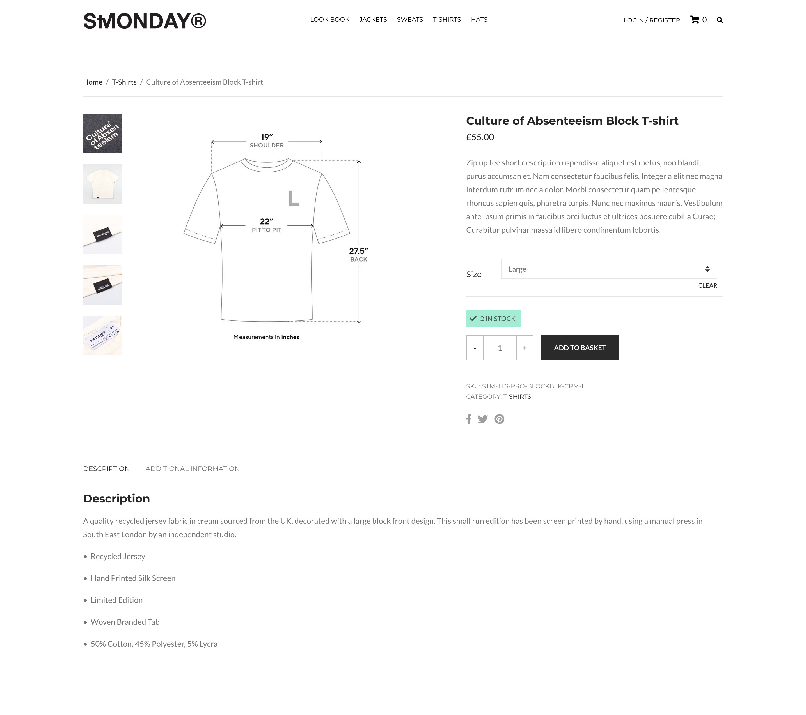
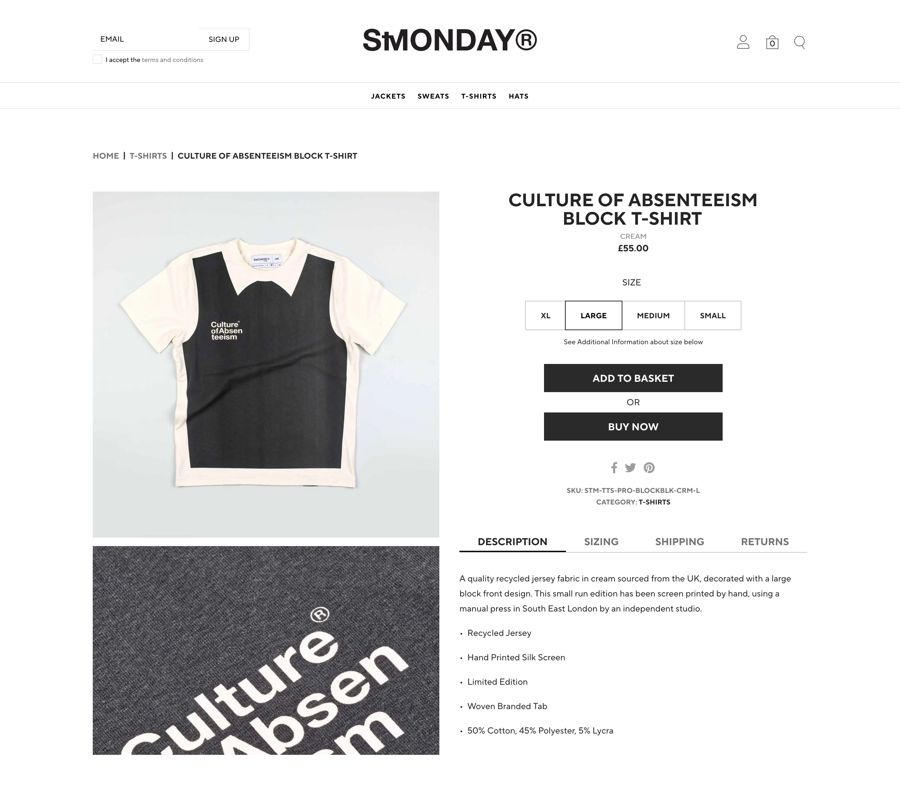
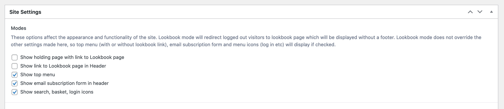
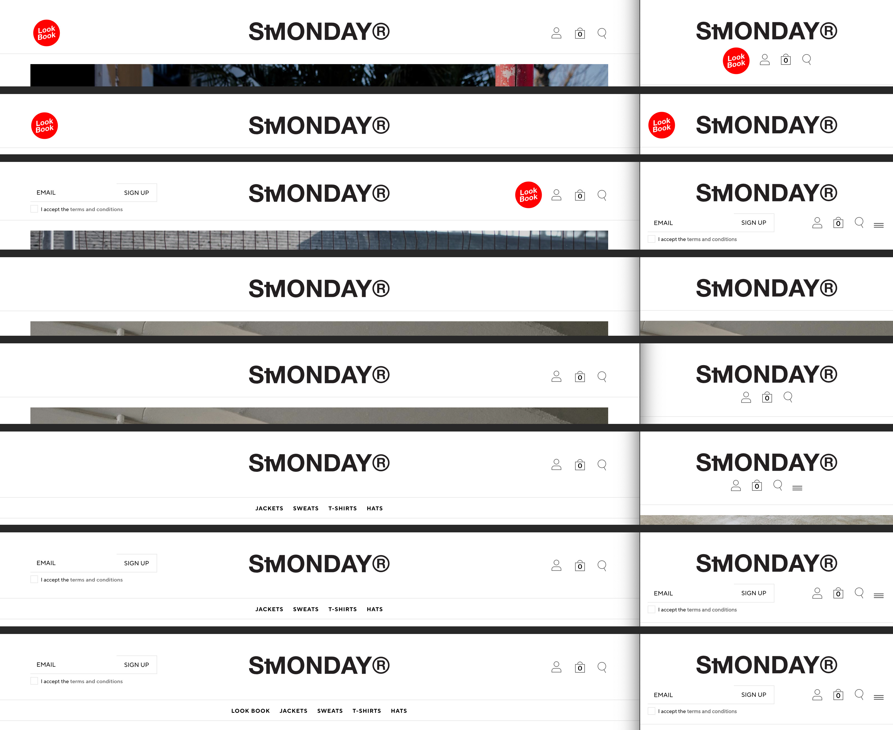

# StMonday Website

  ## Description
WordPress/WooCommerce shop for independent clothing label aimed at the maverick-minded sportsman.

The [deployed site](https://stmonday.xyz/) uses a custom child theme based on the CSSigniter [Neto theme](https://www.cssigniter.com/demo2/?theme=neto). The [product pages](https://stmonday.xyz/product/leaf-blower-windcheater/) in particular were restyled with much greater prominence given to size variations and Buy buttons.
Customisations include:
- Addition of product subtitle
- Conversion of size select menu to stylable radio buttons
- Repositioning of Additional Information tabs to right of product page
- Addition of Sizing, Shipping and Returns tabs to Additional Information 
- Displaying correct image in Sizing tab when different size variation selected
- Addition of sizing message below Buy buttons
- Reconfiguration of Social Media buttons
- Addition of Buy Now button
- Removal of thumbnails from product page
- AJAX handling for lightbox image loading
  
***Below:** The original Neto theme*

  
***Below:** The customised StMonday theme*

  

The header contains various components and the inclusion of each of the following can be toggled from a settings page on the backend:

- Holding page with link to Lookbook page
- Lookbook link in header
- Top menu
- Email subscription form in header
– Search, basket and login buttons

***Below:** The Site Settings panel on the backend*

  
***Below:** A selection of the many possible header configurations, shown at desktop and mobile widths*

  
  
## Questions

Feel free to [email me](mailto:paul@primitive.co?subject=StMonday%20Website%20query%20from%20GitHub) with any queries. If you'd like to see some of my other projects, my GitHub user name is [paulashby](https://github.com/paulashby).